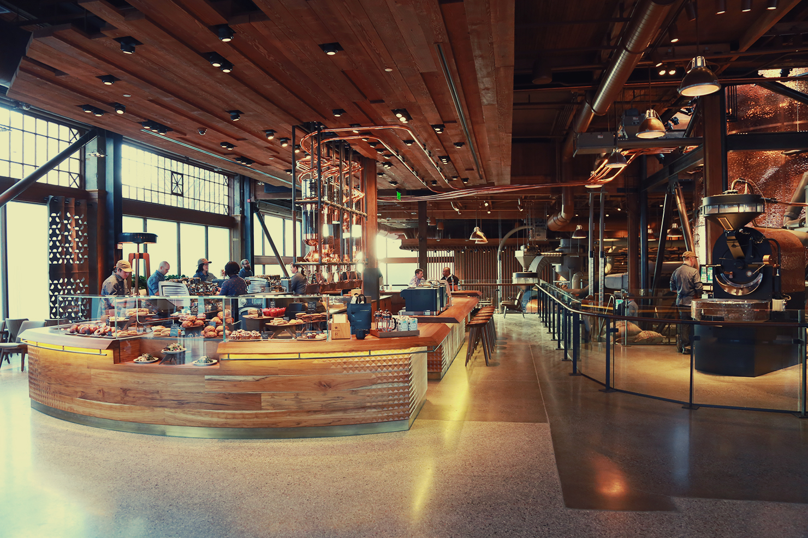

# Starbucks Landing Page

Welcome to the Starbucks Landing Page repository! 
This project showcases a simple responsive landing page for a fictional Starbucks website.

## Preview

## Table of Contents
- [Introduction](#introduction)
- [Features](#features)
- [Installation](#installation)
- [Usage](#usage)
- [Customization](#customization)
- [Contributing](#contributing)
- [License](#license)

## Introduction
This project is a demonstration of a responsive landing page for Starbucks, designed to mimic a possible landing page for the Starbucks website.
The background image and color scheme give the page an inviting and warm feel.
The menu-wrapper section provides buttons for various actions, such as settings, coffee, cake, and pastries.

## Features
- Beautiful and responsive design that adjusts to different screen sizes.
- Attractive background image to create a visually appealing landing page.
- Easy-to-use buttons for various menu options.

## Installation
 Clone the repository:
   git clone https://github.com/your-username/starbucks-landing-page.git
   Open the "index.html" file in your web browser.
## Usage
Feel free to use this project as a template for your own landing pages or customize it to match your requirements. You can change the background image, color scheme, and button text to suit your preferences.

## Customization
You can customize this landing page by modifying the CSS styles in the "main.css" file. Change the background image, colors, font sizes, or other styles to create a unique landing page that suits your needs.

## Contributing
Contributions are welcome! If you have any ideas for improvements, bug fixes, or additional features, feel free to open an issue or submit a pull request.

## License
This project is licensed under the MIT License. You are free to use, modify, and distribute the code for personal and commercial purposes.

We hope you enjoy exploring the Starbucks Landing Page project. If you have any questions or feedback, don't hesitate to reach out!

Contact: rheaalum0126@gmail.com

